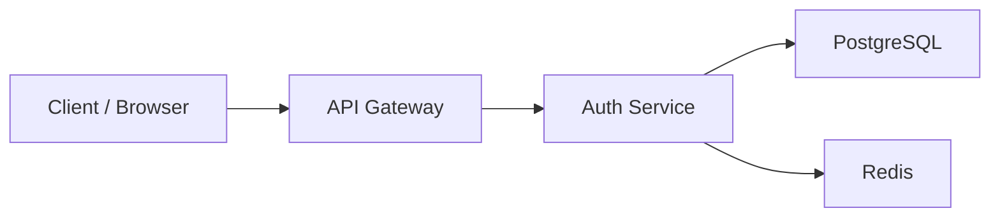
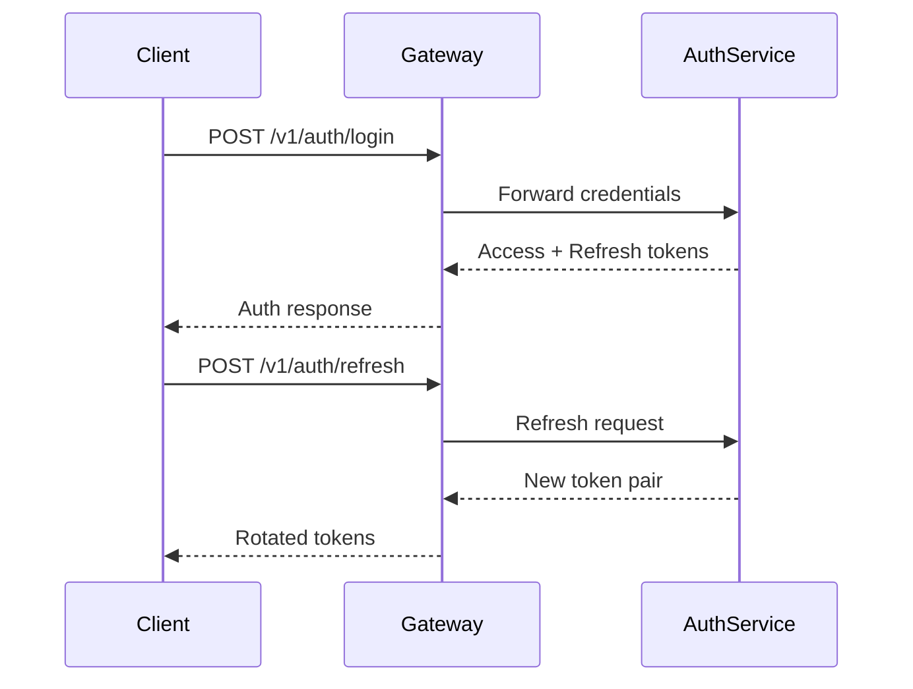
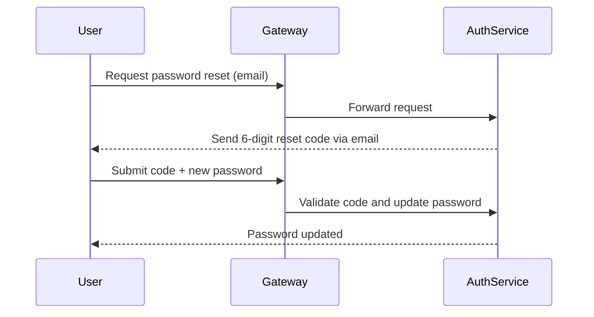

# 🚀 Backend Platform

<p align="center">
  
  
  
  
  
  
</p>

<p align="center">
  Authentication-focused backend platform with token lifecycle management, email-based password recovery, and optional TOTP 2FA.
</p>

---

## 🧭 Overview

`backend-platform` is a security-focused backend platform built with **FastAPI**, **PostgreSQL**, **Redis**, and **Docker**.

It is designed around clear service boundaries and a predictable authentication model.  
The project implements a complete auth flow, including:

- user registration and sign-in
- JWT access and refresh tokens
- refresh token rotation with revocation
- password reset via email verification code
- optional TOTP-based 2FA
- a built-in authentication console for end-to-end testing

The goal of the project is not just to expose auth endpoints, but to model a clean and extensible backend foundation for authentication-heavy systems.

---

## 🏗 Architecture



### Components

#### **API Gateway**
- single entry point for incoming requests
- routes traffic to internal services
- serves the built-in authentication UI
- performs request-level gateway responsibilities

#### **Auth Service**
- registration and login
- JWT token issuance
- refresh token rotation
- token revocation
- password reset flow
- TOTP-based 2FA

#### **PostgreSQL**
- persistent storage for users and auth-related data

#### **Redis**
- token revocation state
- temporary authentication data
- short-lived auth flow support

---

## ✨ Core Features

- **JWT-based authentication**
- **Access + refresh token flow**
- **Refresh token rotation**
- **Refresh token revocation**
- **Password reset via email code**
- **Optional TOTP 2FA**
- **Built-in authentication console**
- **Dockerized development workflow**

---

## 🔐 Authentication Model

### Token Types

#### **Access Token**
- short-lived
- used for authenticated requests

#### **Refresh Token**
- longer-lived
- used to issue new access tokens
- rotated on refresh
- can be revoked

---

## 🔄 Token Lifecycle



### Behavior

- access tokens are used for protected requests
- refresh tokens are used to obtain a new token pair
- refresh tokens are rotated on use
- revoked tokens are tracked in Redis

---

## 🔑 Password Recovery

The platform includes a real email-based password recovery flow.

### Flow



### Security Behavior

- reset codes are time-limited
- the number of attempts is limited
- codes are invalidated after successful use
- password can be changed without the old password after successful verification

---

## 🔐 Two-Factor Authentication (2FA)

The system supports optional two-factor authentication based on **TOTP**.

### Characteristics

- compatible with **Google Authenticator**
- enabled per user
- validated during authentication flow
- intended as an additional security layer on top of password-based login

---

## 🖥 Built-in Authentication Console

The gateway exposes a browser-based authentication console for end-to-end testing.

### Supported flows

- registration
- login
- password reset
- 2FA setup
- logout
- token state visibility

This makes the project easier to validate, demonstrate, and test without external clients.

---

## 🧩 Service Layout

```text
services/
  auth-service/
  api-gateway/
```

---

## 🛠 Tech Stack

| Layer | Technology |
|---|---|
| Runtime | Python 3.12+ |
| Framework | FastAPI |
| ORM | SQLAlchemy |
| Database | PostgreSQL |
| Cache / State | Redis |
| Auth | JWT |
| Password Hashing | Argon2 |
| 2FA | TOTP (`pyotp`) |
| Containerization | Docker |
| Local Orchestration | Docker Compose |

---

## 📡 API Surface

### Authentication Endpoints

```text
POST /v1/auth/register
POST /v1/auth/login
POST /v1/auth/refresh
POST /v1/auth/logout

POST /v1/auth/2fa/enroll
POST /v1/auth/2fa/verify
POST /v1/auth/2fa/validate
```

---

## 🌐 Example Response

```json
{
  "access_token": "eyJhbGciOi...",
  "refresh_token": "def50200..."
}
```

---

## 🚀 Getting Started

### Prerequisites

- Docker
- Docker Compose
- Python 3.12+
- `make`

### Quick Start

```bash
git clone https://github.com/pargevk1996-a11y/backend-platform.git
cd backend-platform

make deps
bash infra/scripts/bootstrap.sh
make up
```

### Apply Migrations

```bash
make migrate-auth
```

---

## ⚙️ Configuration

Environment files are bootstrapped automatically:

```bash
bash infra/scripts/bootstrap.sh
```

Typical configuration includes:

| Variable | Description |
|---|---|
| `DATABASE_URL` | PostgreSQL connection string |
| `REDIS_URL` | Redis connection string |
| `JWT_SECRET` / signing material | token signing configuration |
| `TOTP_ISSUER` | name shown in authenticator apps |

---

## 🔒 Security Notes

- passwords are hashed using **Argon2**
- refresh tokens are **rotated**
- revoked tokens are tracked in **Redis**
- password reset uses **expiring verification codes**
- TOTP adds an optional second authentication factor
- sensitive auth flows rely on validated authentication context

---

## 📊 System Characteristics

- clear auth-focused architecture
- separated gateway and service responsibilities
- predictable token lifecycle
- account recovery support
- optional 2FA
- dockerized local environment

---

## 👨‍💻 Author

**Pargev Khachatryan**

Backend developer focused on authentication flows, backend architecture, and security-oriented system design.

---

## 📄 License

MIT © [pargevk1996-a11y](https://github.com/pargevk1996-a11y)

---

<div align="center">
  <sub>Built with ❤️ using FastAPI, PostgreSQL, Redis, and a security-first mindset.</sub>
</div>
