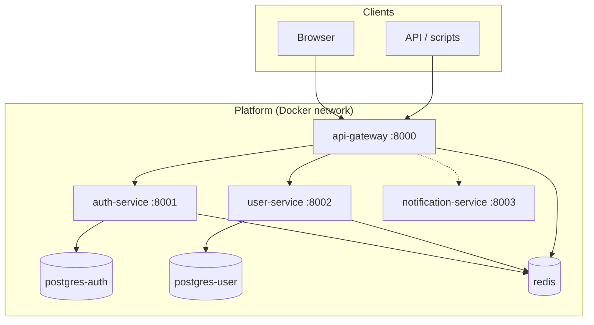
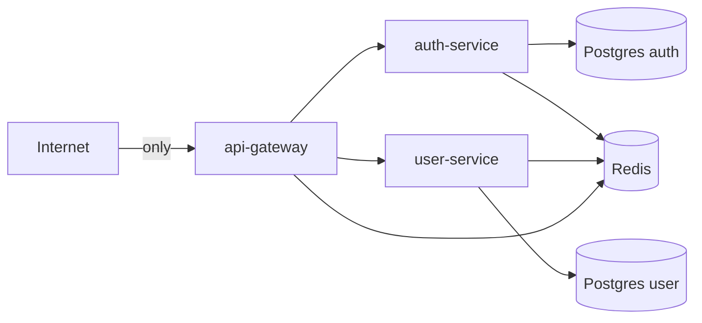
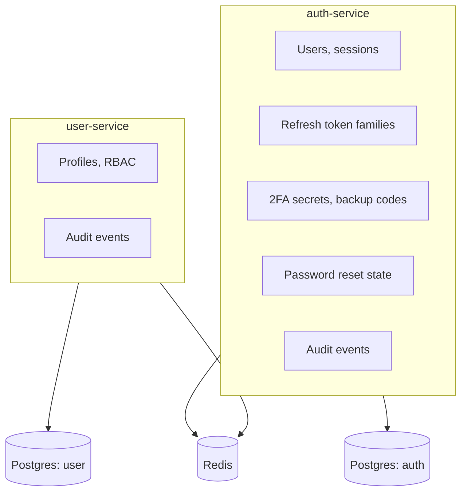
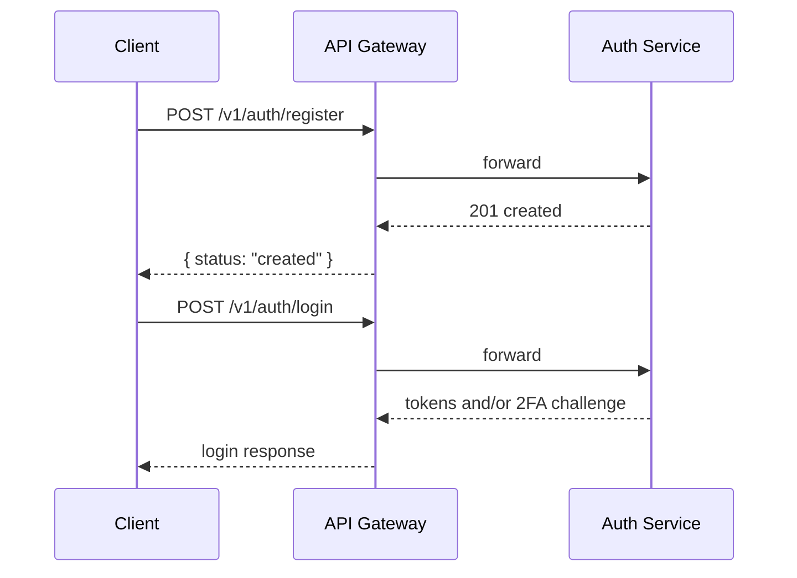
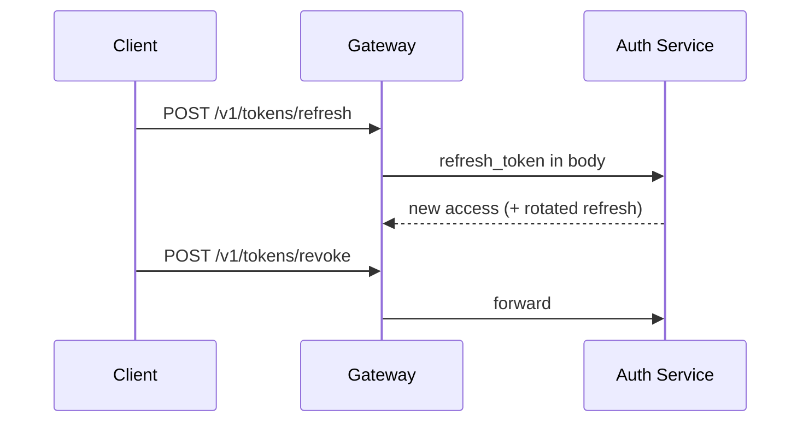
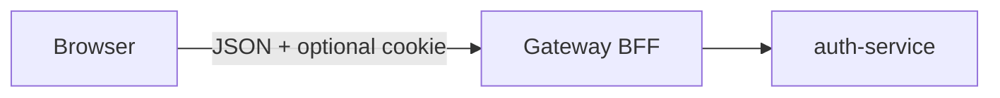
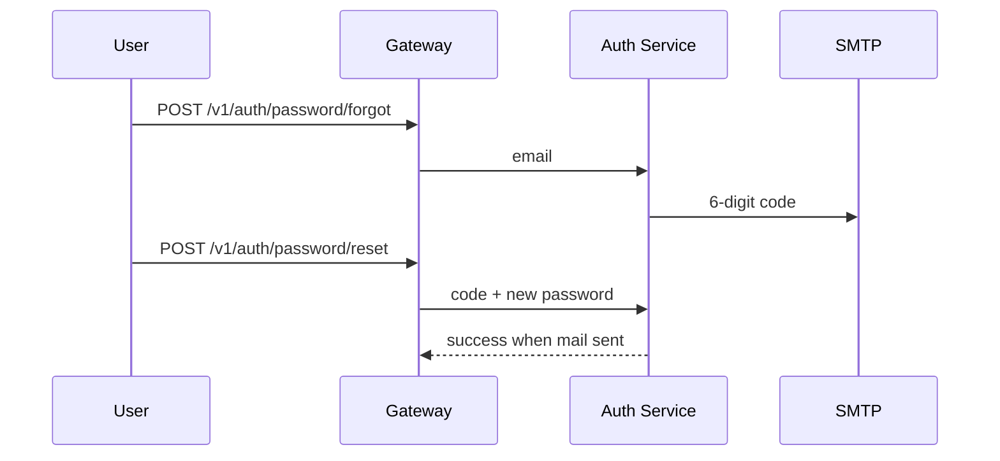
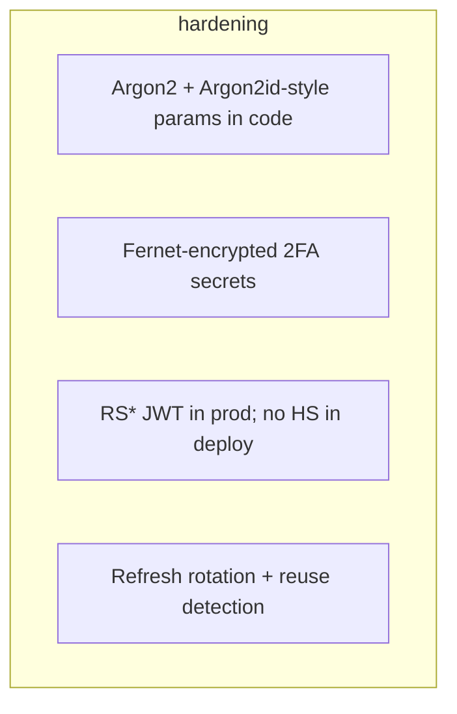

<div align="center">

# Backend Platform

**Authentication-first microservice stack** — FastAPI, PostgreSQL, Redis, Docker.  
JWT access + opaque refresh (rotation, reuse detection), **TOTP 2FA**, **email password reset**, and a **browser auth console** on the API gateway.

<p>
  
  
  
  
  
  
</p>

[Overview](#overview) · [Architecture](#architecture) · [Authentication](#authentication-flows) · [Local dev](#local-development) · [Deploy (AWS)](#ec2-and-production-deploy) · [API](#api-surface) · [Security](#security) · [More docs](#further-reading)

</div>

---

## Overview

| Layer | What you get |
|--------|----------------|
| **Edge** | `api-gateway` — routing, CORS, rate limits, static **`/ui`** console, **browser BFF** (`/v1/browser-auth/*`, HttpOnly refresh cookie) |
| **Identity** | `auth-service` — register, login, 2FA, JWT, refresh rotation/revocation, password reset, sessions |
| **Users** | `user-service` — profiles, roles, permissions (**RBAC**) |
| **Extensibility** | `notification-service` — health + hook for outbound notifications |
| **Shared** | `shared/python` — common config / contracts (pin versions; **pip-audit** in CI) |

**Design goals:** clear boundaries, **defense in depth** (tokens verified at the gateway and where services require it), operable **Compose** + **runbooks** under `docs/`.

---

## Architecture

### System context



### Trust boundaries (production mental model)



### Dev ports (default `docker-compose.dev.yml`)

| Service | Host bind | Notes |
|---------|-----------|--------|
| **api-gateway** | `127.0.0.1:8000` | Public API + **`/ui`** |
| **auth-service** | `127.0.0.1:8001` | Internal (gateway proxies) |
| **user-service** | `127.0.0.1:8002` | Internal |
| **Postgres / Redis** | loopback | Not exposed to LAN by default |

**Liveness:** `GET /v1/health/live` (gateway and each service expose health routes).

---

## Data stores (by service)



| Store | Role |
|-------|------|
| **PostgreSQL (auth)** | Users, refresh families, sessions, TOTP/backup material, password-reset rows, audit |
| **PostgreSQL (user)** | App users, profiles, roles, permissions, bindings, audit |
| **Redis** | Rate limits, brute-force counters, login/2FA challenge data, access-session revoke flags (with access JWT) |

---

## Authentication flows

### Register → sign-in (no auto-session)

Registration returns **`201`** with `{"status":"created"}` — **no** token pair. The client must call **login** explicitly (API contract by design).



### Machine client: refresh & revoke



### Browser BFF (same origin as UI)

- Routes under **`/v1/browser-auth/*`**
- Refresh can be in an **HttpOnly** cookie (`REFRESH_COOKIE_*` in gateway config).
- For **HTTP** demos (e.g. raw EC2 IP), align **`REFRESH_COOKIE_SECURE`** with your scheme or the refresh cookie will not be stored/sent.



### Password reset (email)



Configuration: **SMTP** via `services/auth-service` env and/or `secrets/smtp_*.txt` (see `docs/smtp-aws-ec2.md`).

---

## Service layout

```text
services/
  api-gateway/         # Edge, static UI, proxy, rate limits, browser BFF
  auth-service/        # Identity, tokens, 2FA, reset, sessions
  user-service/        # Profiles + RBAC
  notification-service/ # Pluggable notifications
shared/python/         # Shared package (pinned in requirements.lock)
infra/                 # Dockerfiles, docker-compose (dev + prod), scripts
docs/                  # Architecture, API, runbooks, security notes
```

---

## Local development

**Requirements:** Docker + Compose plugin, `make`, Python **3.12+** (for venv and tests).

```bash
git clone <repo-url> backend-platform
cd backend-platform
make deps
# Prepare services/*/.env (see each services/*/.env.example; optional: bash infra/scripts/bootstrap.sh)
make up
make migrate-auth
make migrate-user
```

- **UI:** [http://127.0.0.1:8000/ui/](http://127.0.0.1:8000/ui/) — **Gateway URL** in the form should match the page origin for the **browser** flow.
- **Stop:** `make down`

| Command | Purpose |
|---------|---------|
| `make test` | All service tests (needs venv) |
| `make test-auth` / `test-gateway` / `test-user` | Per service |
| `make test-e2e-auth` | E2E vs running gateway; `GATEWAY_BASE_URL` if not default |
| `make lint-auth` (etc.) | Ruff |

---

## Configuration & secrets

| Location | Use |
|----------|-----|
| `services/*/.env.example` | Copy to `services/*/.env` (never commit real secrets) |
| `infra/compose/.env.compose` | DB/redis passwords, gateway port, SMTP hints (prod) |
| `secrets/` (repo root) | JWT PEM, peppers, TOTP key, **Gmail app password** files — **gitignored** |

**Production / EC2:** `infra/scripts/render_prod_env_from_secrets.py --cors-origins "..."` merges compose + `secrets/` into per-service env files. See **`docs/smtp-aws-ec2.md`**.

---

## EC2 and production deploy

- **Browser `/ui` HTTP and HTTPS:** The gateway sets the refresh cookie **`Secure` only when the browser-facing request is HTTPS** (direct TLS to the gateway, or **`X-Forwarded-Proto: https`** from an address in **`TRUSTED_PROXY_IPS`**, e.g. an ALB or reverse proxy). Plain `http://` still gets a working cookie without manual `REFRESH_COOKIE_SECURE=false`. Override only if needed: **`REFRESH_COOKIE_SECURE=true|false`** in `services/api-gateway/.env`.
- **Stack file:** `infra/compose/docker-compose.prod.yml` + `infra/compose/.env.compose`
- **Update in place** (on the server, from clone root):

```bash
export CORS_ORIGINS="http://YOUR_IP:PORT,http://YOUR_IP"
# export BRANCH=main   # optional; default in ec2_update.sh
bash infra/scripts/ec2_update.sh
```

- **Egress:** allow **TCP 587** (or your provider’s SMTP port) to the public internet.
- **Secrets dir:** file modes must let the **container user** read bind mounts (see runbook in `docs/smtp-aws-ec2.md`).

---

## API surface

**Gateway** is the public entry. Public (unauthenticated) **prefix examples** (see `api-gateway` constants for the exact set):

- `POST /v1/auth/register` · `POST /v1/auth/login` · `POST /v1/auth/login/2fa`
- `POST /v1/auth/password/forgot` · `POST /v1/auth/password/reset`
- `POST /v1/tokens/refresh` · `POST /v1/tokens/revoke`
- `POST /v1/browser-auth/...` (register, login, 2fa, refresh, revoke)
- `GET /v1/health/live` · `GET /v1/health/ready`

Protected routes require **`Authorization: Bearer <access_token>`** (e.g. `GET /v1/sessions/me`, `/v1/two-factor/...` via proxy).

**Authoritative list:** `services/api-gateway/app/core/constants.py` and OpenAPI of each service.

---

## Security

- **Argon2** for passwords; **TOTP** material encrypted at rest; backup codes **hashed**.
- **Refresh:** rotation, reuse detection, family revoke; access sessions can be invalidated in Redis.
- **Rate limits** and lockouts on login, 2FA, register, and password reset.
- **Logging:** JSON structured logs; avoid logging raw tokens, codes, or secrets.
- Deeper: **`docs/architecture/threat-model.md`**, **`docs/security/`**.



---

## Further reading

| Path | Content |
|------|--------|
| `docs/architecture/system-design.md` | Services and stores |
| `docs/architecture/auth-flow.md` | End-to-end auth |
| `docs/api/gateway.md` | Gateway behaviour |
| `docs/api/auth-service.md` | Auth API notes |
| `docs/smtp-aws-ec2.md` | SMTP on EC2 |
| `docs/runbooks/` | Incidents, rotation, etc. |

---

## Diagrams: “pictures” in this README

- All figures above are **Mermaid** — they are **versionable text**, render on **GitHub**, and stay sharp at any zoom.
- To add **raster/vector** assets (e.g. exported from Excalidraw / draw.io), place files under `docs/images/` and link: `` (add the files in a follow-up commit — not required for a professional README if Mermaid is enough).

---

## Author

**Pargev Khachatryan** — backend and security-oriented platform work.

## License

See the **LICENSE** file in the repository when present (this project is commonly distributed under **MIT**). If none is committed, check with the repository owner.

---

<div align="center">
  <sub>FastAPI · PostgreSQL · Redis · security-first token lifecycle</sub>
</div>
